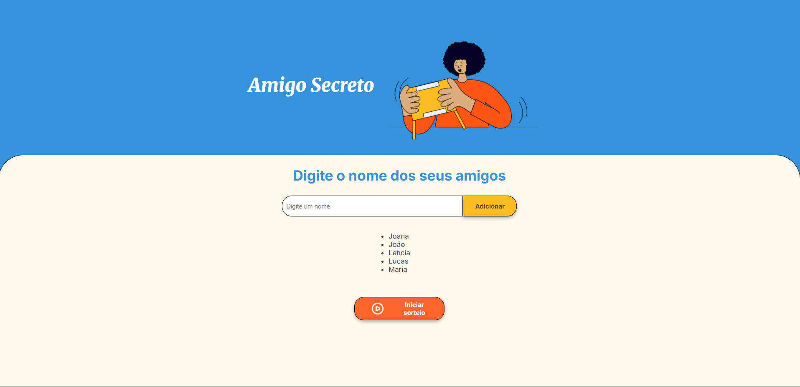
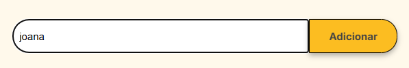
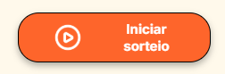
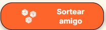
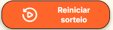

# Amigo Secreto

Sabe quando chega uma época do ano em que você e sua família ou amigos se reúnem para fazer aquela brincadeira do amigo secreto e todas as vezes precisa escrever os nomes nos papeizinhos? 
Pois bem, esse projeto é uma forma de resolver a atividade entediante de escrever e cortar todos os papeizinhos!

Nesse projeto, o usuário pode inserir todos os nomes na lista e depois cada pessoa pode "tirar" seu papelzinho, sem espionar o nome que o outro tirou ;)

## 🔨 Funcionalidades

* **Adicionar nomes**: O usuário poderá escrever o nome de seus amigos em um campo de texto e os adicionar na lista de amigos para o sorteio. Os nomes são adicionados em ordem alfabética para facilitar a visualização de quais nomes já foram adicionados. Nomes repetidos não serão adicionados.

* **Iniciar sorteio**: Ao ser pressionado, o sistema permite que o sorteio comece e então nenhum outro nome será adicionado.

* **Sortear amigo**: Após iniciar o sorteio, o usuário irá sortear um amigo que ainda não tenha sido sorteado.

* **Resortear amigo**: Caso o usuário sorteie o próprio nome ou por outro motivo que seja necessário sortear novamente sem começar todo o sorteio.

* **Confirmar resultado**: Para confirmar que o resultado do sorteio não há problemas. Assim que o resultado ser confirmado, o nome sorteado é escondido para que a próxima pessoa a sortear não veja o resultado anterior.

* **Reiniciar sorteio**: Caso seja necessário reiniciar todo o sorteio. Por exemplo, se algum nome foi esquecido de ser inserido na lista do sorteio.

## 📂 Como instalar o projeto?

Você pode baixar o .zip do projeto por este [link](https://github.com/IsadoraVanco/AmigoSecreto/archive/refs/heads/main.zip).

## 🛠️ Como rodar o projeto? 

Para testar o projeto, você precisará apenas de um navegador web:

1. Baixe o zip do projeto e o descompacte;
2. Abra o arquivo `index.html` pelo navegador de sua preferência.

**OBS**: Pode-se utilizar a extensão `Live Server` no VS Code para que o projeto seja aberto e reiniciado automaticamente a cada alteração salva.

## ✔️ Tecnologias utilizadas

* `HTML`
* `CSS`
* `JavaScript`